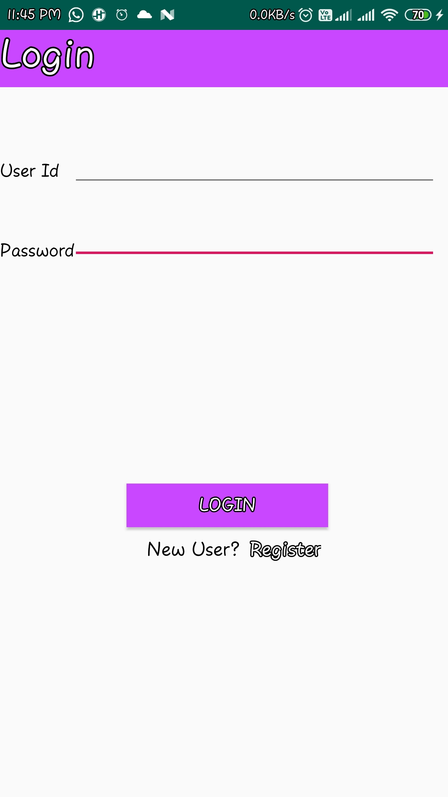
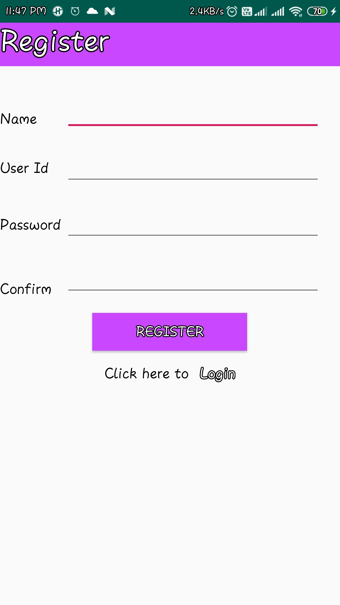
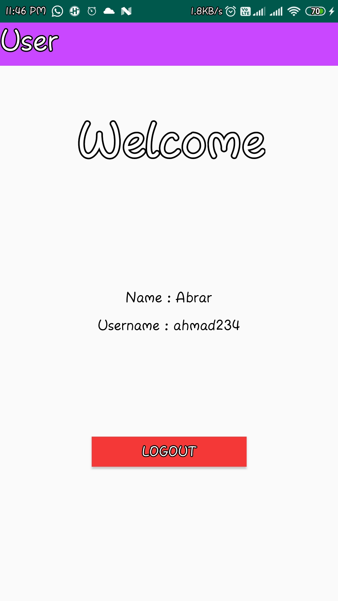

# Login-Android-with-Data-Base

* This is a app where use stores credentials and so that user can login again.
* Your Data  will be consistent and saved in offline storage so that you can login again without hassle.
* It was good experience, I learned handling data base using android, and  also android login work flow.

## ScreenShots
**Login:**

**Register:**

**User:**

